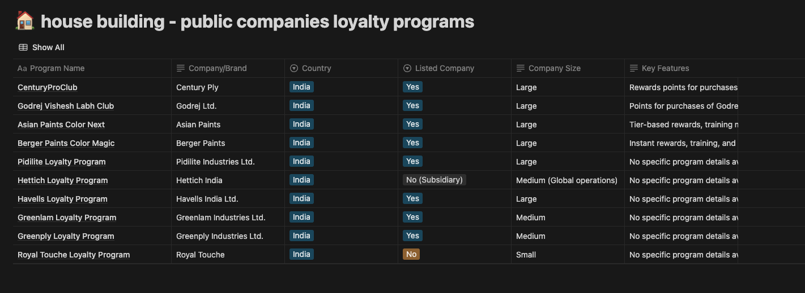

# Bolekaam - Empowering India's Craftsmen Through Voice Technology

## The Opportunity

India's informal skilled workforce—45 million craftsmen across tier 2-4 cities—forms the backbone of our construction and home services sector. These skilled professionals create extraordinary value but remain digitally underserved, trapped in inefficient word-of-mouth networks that limit their earning potential and growth.

## The Problem

Traditional craftsmen face three critical barriers:

- **Language & literacy gaps** prevent using existing digital platforms
- **Limited digital presence** restricts access to new customers
- **Fragmented material sourcing** increases costs and reduces quality

While platforms like Urban Company succeed in metro cities, they fail to penetrate deeper markets due to their text-heavy interfaces, English-first approach, and high commission structures.

## Our Solution: Bolekaam

We've built a first-of-its-kind Hindi voice assistant on WhatsApp that transforms how craftsmen manage their businesses:

1. **Voice-First Digital Identity**: Craftsmen speak to create professional profiles, customized landing pages, and business materials
2. **Personalized Web Presence**: Every craftsman gets their own professional website (name.bolekaam.com) through simple voice commands
3. **Seamless Customer Connections**: Voice-enabled inquiry handling and job management
4. **Automated Reputation Building**: Simplified Google review generation increases visibility
5. **Quality Material Access**: Direct connections to trusted brands with preferential pricing

## Why Now?

Three converging trends create our opportunity window:

- **Voice AI advancement**: Hindi language processing has reached 95% accuracy
- **WhatsApp penetration**: 96% of smartphone users in tier 2-4 cities use it daily
- **Digital discovery shift**: Even in tier 2-4 cities, 73% of customers now search online before hiring

## Market Research: House Building Companies Loyalty Programs

Here's a snapshot of loyalty programs in the house building and construction sector in India:

This research shows that most major companies in the sector have established loyalty programs, particularly targeting professionals in the construction industry. This validates the market need for professional networking and rewards in the construction sector.

## Market Opportunity

Our addressable market includes:

- 45M skilled craftsmen across India
- ₹70,000 crore annual construction material market
- ₹2.3 lakh crore home services market in tier 2-4 cities

## Business Model

Our unique multi-sided model ensures sustainability:

1. **Material brand partnerships**: Brands pay to reach qualified craftsmen (primary revenue)
2. **Premium web presence**: Enhanced website features and custom domains
3. **Financial services**: Facilitating material financing and payment processing

## The Vision

While we're starting with carpentry in Rajasthan, our platform architecture supports rapid expansion across:

- **Multiple trades**: Plumbing, electrical, painting, masonry
- **Geographic regions**: Pan-India coverage with dialect adaptation
- **Digital ecosystem**: From simple landing pages to comprehensive online businesses

Bolekaam isn't just a platform—it's a movement to bring the digital economy to India's skilled workforce, preserving traditional craftsmanship while unlocking modern economic opportunity.

## Competitive Analysis

- **Urban Company**: Focused on urban India with an operations-heavy business model
- **Lokal**: Nearest competitor but positioned as a super app without specific focus on craftsmen
- **Traditional Platforms**: Text-heavy interfaces that create barriers for craftsmen

Our key differentiator is our voice-first approach, specifically designed for craftsmen in tier 2-4 cities, focusing on trust-building between clients and craftsmen while enabling greater reach and income potential. 