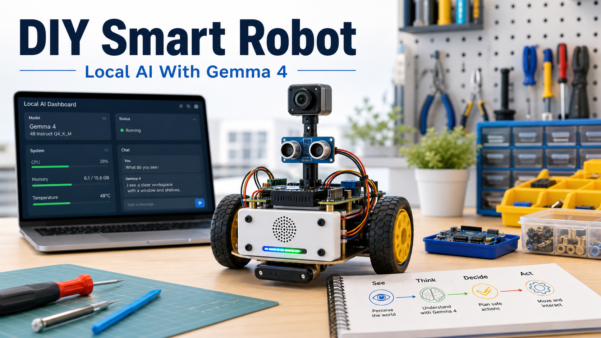

# DIY Smart Robot With a Local Gemma Brain



The best way to build a small AI robot is to keep the architecture boring.

Use the local model for high-level reasoning, explanations, and plans. Use deterministic firmware for timing, motor control, watchdogs, limits, and emergency stop. The model should never drive motors directly.

That separation is the whole project.

## Goal

Build a small rover that can:

- See through a camera
- Talk through a local chat or voice interface
- Move safely through short constrained commands
- Run high-level reasoning through a local Gemma-style model
- Log every run so behavior can be debugged

The first version should use a laptop brain. Put the expensive compute on the desk, keep the robot cheap, and prove the behavior before fighting battery and thermal limits.

## System overview

Think of the robot as four layers:

| Layer | Job |
| --- | --- |
| Local model host | Runs the model and exposes a small local API. |
| Robot app | Converts camera frames and sensor readings into scene summaries and safe intents. |
| Microcontroller | Validates commands, reads sensors, controls motors, and enforces timeouts. |
| Physical body | Chassis, wheels, motor driver, sensors, battery, switch, and wiring. |

The boundary is strict: the model returns intents like `stop`, `turn_left`, or `describe_scene`. The controller decides whether those intents are safe to execute.

## Core parts

Start with the minimum:

- Chassis
- Two DC gear motors
- Wheels and caster
- Motor driver
- Microcontroller
- Battery
- Physical switch
- Regulator
- Wires and mounting hardware

Then add sensing:

- Camera
- Distance sensor
- Bumper switch
- Optional IMU

Voice can wait. Get motion and stop behavior reliable first.

## Version A: laptop brain

This is the easiest first build.

The laptop runs inference, logs prompts, and hosts a local API. The robot connects over USB serial. Messages stay tiny:

```text
command: forward speed=0.25 duration_ms=500
status: distance_cm=42 battery=7.4 state=ok
```

Do not send free-form model text to the motor controller. Translate every model answer into a fixed command schema first.

## Step 1: chassis

Dry-fit the chassis, motor brackets, caster, and board mounts before tightening anything. Keep the battery low and centered so the robot does not tip during turns.

Leave access to:

- USB
- Reset button
- Power switch
- Battery connector
- Motor driver terminals

Robots become much harder to debug when the useful ports are trapped under parts.

## Step 2: wheels and motors

Make both wheels parallel. Label left and right motors. Lift the wheels off the table for the first motor test.

If a motor spins backward, fix it in wiring or firmware. Do not patch it in the model prompt.

## Step 3: motor driver

The motor driver separates low-current controller signals from higher-current motor power.

Firmware should reject:

- Speeds above the configured limit
- Movement while emergency stop is active
- Movement while obstacle distance is below the safety threshold
- Commands that run longer than the maximum duration

Logic ground and motor power ground need a shared reference unless the driver explicitly isolates them.

## Step 4: power

Make power boring:

- Physical switch
- Fuse
- Correct regulator
- Separated motor and logic rails where needed
- Multimeter check before connecting boards

Do not debug AI behavior on an unstable power system. Voltage drops create fake software problems.

## Step 5: sensors

Mount the camera high enough to see the floor and nearby objects. Add a distance sensor or bumper as a hard safety input independent of model reasoning.

Cable routing matters. Keep wires away from wheels and leave service loops so boards can be removed for debugging.

## Firmware loop

The controller loop should be simple and suspicious:

1. Receive command.
2. Validate schema.
3. Check safety state.
4. Drive motors for a short interval.
5. Read sensors.
6. Report status.
7. Stop if commands time out.

Obstacle, bumper, low-battery, and emergency-stop states override model requests.

## Local model loop

The model loop should be equally constrained:

1. Capture a camera frame.
2. Convert perception into a short scene summary.
3. Ask the model for a bounded decision.
4. Parse the answer into a fixed intent.
5. Let the controller accept or reject it.
6. Log the prompt, response, command, and sensor state.

The model is useful for reasoning and conversation. The controller is responsible for trust.

## First three skills

### Conversation

Start with motors disabled. Ask the robot to describe visible objects, answer simple questions, and explain whether movement would be safe.

This validates camera framing, latency, and hallucination behavior without physical risk.

### Obstacle rover

Give the model only a few safe actions: stop, turn left, turn right, forward slowly. Use short movements, then stop, re-sense, and decide again.

Distance readings should stop the robot even if the model thinks the path is clear.

### Object follow

Use a bright object or marker. Define a minimum following distance and a stop band before enabling motion.

If the target disappears, stop and ask for a scene description. Do not search blindly.

## Upgrade paths

Once the laptop-brain rover works, choose one learning track:

- Onboard brain: adds power, heat, weight, and runtime constraints.
- Voice companion: adds microphone, speaker, push-to-talk, and local speech recognition.
- Arm add-on: adds manipulation and a much larger safety surface.
- Outdoor base: adds terrain, weather, localization, and stronger power requirements.

Pick the smallest upgrade that unlocks the next skill. Then return to the test course.

## Build notes

This is a learning scaffold, not an electrical certification or final parts specification. Verify voltages, current limits, battery chemistry, motor-driver ratings, and local laws before building a moving device.

Keep the robot easy to stop, easy to inspect, and easy to log. That is what lets the AI part stay fun.
